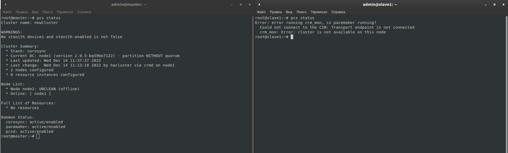

# Домашнее задание к занятию "Pacemaker" - Серебряков Руслан

### Задание 1.

Опишите основные функции и назначение Pacemaker.

*Приведите ответ в свободной форме.*

---

Pacemaker это программное решение от компании ClusterLabs для создания отказоустойчивых кластерных систем.
Его основная задача - это обеспечение наибольшей доступности ресурсов, а также
1) Обнаружение и восстановление сбоев узлов на уровне сервисов.
2) Независимость от подсистемы хранения (не требуется общий диск).
3) Независимость от типа ресурсов (всё что может быть заскриптовано - может быть кластеризованно).
4) Поддержка STONITH.
5) Поддержка кластеров любого размера.
6) Поддержка кворумных и ресурсозависимых кластеров.
7) Автоматическая репликация конфигурации
8) Возможность задания порядка запуска ресурсов, а также их совместимости на одном узле.
9) Поддержка расширенных типов ресурсов клонов (запущен на множестве узлов) и с дополнительными состояниями (msater/slave)
10)Единый кластерный шелл (crm), унифицированный скриптующийся.

---
---

### Задание 2.

Опишите основные функции и назначение Corosync.

*Приведите ответ в свободной форме.*

---

Это проект с открытым исходным кодом реализующий систему группового общения для отказоустойчивых кластеров. Является развитием проекта OpenAIS.
В основные функции входит: 
1) Отслеживание состояния приложений
2) Оповещение о смене активной ноды кластера
3) Отправка одинаковых сообщений всем процессам на всех узлах кластера
4) Предоставление доступа к базе данных с конфигурацией и статистикой, а также отправка уведовлений о её изменениях.

---
---

### Задание 3.

Соберите модель, состоящую из двух виртуальных машин. Установите pacemaker, corosync, pcs.  Настройте HA кластер.

*Пришлите конфигурации сервисов для каждой ноды, конфигурационный файл corosync и бэкап конфигурации pacemaker при помощи команды pcs config backup filename.*

---

Я очень старался. Я несколько раз ставил систему в облаке пробовал разные комбинации машин (хех, их было всего 2: 3 ноды и 2 ноды).
По этому заданию у меня пока, что есть скрин с вопросом =)
В лекции преподаватель говорил, что результат комады "pcs status" должен быть одинаковый на всех нодах, но у меня он разный хотя и левый терминал(master) и правый (slave) бъединены в кластер =\

---
---

### Дополнительные задания (со звездочкой*)
Эти задания дополнительные (не обязательные к выполнению) и никак не повлияют на получение вами зачета по этому домашнему заданию. Вы можете их выполнить, если хотите глубже и/или шире разобраться в материале.
 
---

### Задание 4.

Установите и настройте DRBD сервис для настроенного кластера.

*Пришлите  конфигурацию DRBD сервиса - *.res ресурсов для каждой ноды.**